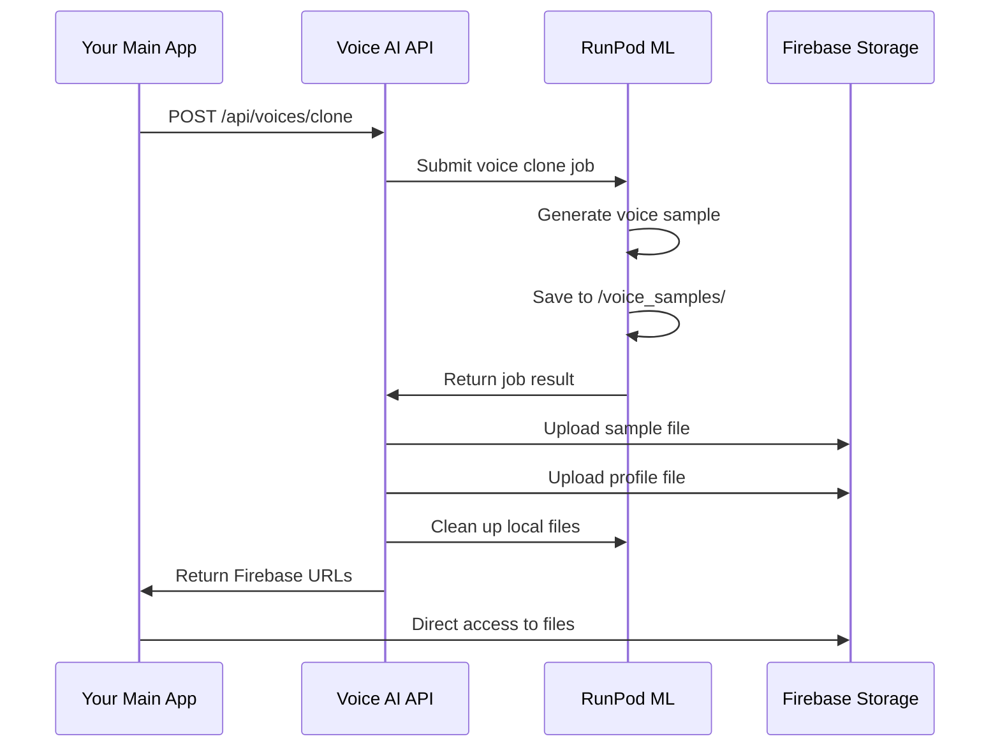
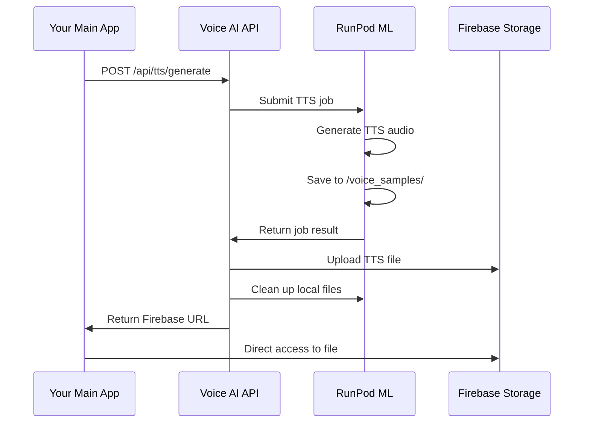

# 🔄 Shared Storage Workflow: RunPod → Firebase → Shared Access

## **Overview**

This document explains how the voice AI API implements **shared storage** between RunPod ML inference and your main application using Firebase Storage as the central hub.

## **🏗️ Architecture**

```
┌─────────────────┐    ┌─────────────────┐    ┌─────────────────┐
│   Your Main App │◄───│  Voice AI API   │◄───│   RunPod ML     │
│                 │    │  (This App)     │    │   (Inference)   │
└─────────────────┘    └─────────────────┘    └─────────────────┘
                                │
                                ▼
                       ┌─────────────────┐
                       │   Firebase      │
                       │   Storage       │
                       │   (Shared)      │
                       └─────────────────┘
```

## **🔄 Workflow Steps**

### **1. Voice Cloning Workflow**



### **2. TTS Generation Workflow**



## **📁 Firebase Storage Structure**

```
firebase-storage/
├── voices/
│   ├── voice_john_doe/
│   │   ├── samples/
│   │   │   ├── voice_john_doe_sample_20250725_163000.wav
│   │   │   └── voice_john_doe_sample_20250725_170000.wav
│   │   └── profiles/
│   │       └── voice_john_doe.npy
│   └── voice_jane_smith/
│       ├── samples/
│       │   └── voice_jane_smith_sample_20250725_165000.wav
│       └── profiles/
│           └── voice_jane_smith.npy
└── tts/
    ├── gen_20250725_163000/
    │   └── TTS_voice_john_doe_20250725_163000.wav
    └── gen_20250725_170000/
        └── TTS_voice_john_doe_20250725_170000.wav
```

## **🔗 API Endpoints for Shared Access**

### **Voice Management**

```bash
# Create voice clone (auto-uploads to Firebase)
POST /api/voices/clone
# Returns: Firebase URLs for sample and profile

# Get all Firebase URLs for a voice
GET /api/voices/{voice_id}/firebase-urls
# Returns: All sample and profile URLs

# Get latest sample from Firebase
GET /api/voices/{voice_id}/sample/firebase
# Returns: Direct Firebase URL for latest sample
```

### **TTS Generation**

```bash
# Generate TTS (auto-uploads to Firebase)
POST /api/tts/generate
# Returns: Firebase URL for TTS file

# Get TTS from Firebase
GET /api/tts/generations/{generation_id}/firebase
# Returns: Direct Firebase URL for TTS file

# Get storage usage
GET /api/tts/storage/usage
# Returns: Firebase storage statistics
```

## **💡 Benefits of Shared Storage**

### **✅ Advantages**

1. **No File Transfer**: No need to transfer files between apps
2. **Scalable**: Firebase handles storage scaling
3. **Direct Access**: Main app can access files directly via URLs
4. **No Local Storage**: No local file management needed
5. **Automatic Cleanup**: RunPod files cleaned up after upload
6. **CDN Benefits**: Fast global access via Firebase CDN
7. **Version Control**: Firebase maintains file versions
8. **Security**: Firebase provides access control

### **🔄 Workflow Benefits**

1. **RunPod**: Focuses only on ML inference
2. **Voice AI API**: Handles orchestration and Firebase upload
3. **Main App**: Direct access to all files via URLs
4. **Firebase**: Central storage with automatic scaling

## **📊 Example API Responses**

### **Voice Clone Response**

```json
{
  "status": "success",
  "voice_id": "voice_john_doe",
  "voice_name": "John Doe",
  "audio_base64": "UklGRiQAAABXQVZFZm10...",
  "profile_base64": "npy_data_here...",
  "metadata": {
    "firebase_urls": {
      "sample_url": "https://storage.googleapis.com/bucket/voices/voice_john_doe/samples/voice_john_doe_sample_20250725_163000.wav",
      "profile_url": "https://storage.googleapis.com/bucket/voices/voice_john_doe/profiles/voice_john_doe.npy"
    },
    "shared_access": true,
    "uploaded_at": "2025-07-25T16:30:00Z"
  }
}
```

### **TTS Generation Response**

```json
{
  "status": "success",
  "generation_id": "gen_20250725_163000",
  "voice_id": "voice_john_doe",
  "text": "Hello, this is a test...",
  "audio_base64": "UklGRiQAAABXQVZFZm10...",
  "metadata": {
    "firebase_urls": {
      "tts_url": "https://storage.googleapis.com/bucket/tts/gen_20250725_163000/TTS_voice_john_doe_20250725_163000.wav"
    },
    "shared_access": true,
    "uploaded_at": "2025-07-25T16:30:00Z"
  }
}
```

## **🔧 Implementation Details**

### **Firebase Service Methods**

```python
# Upload from RunPod to Firebase
firebase_service.upload_runpod_voice_sample(voice_id, filename)
firebase_service.upload_runpod_tts_generation(generation_id, filename)
firebase_service.upload_voice_profile(voice_id, filename)

# Get shared access URLs
firebase_service.get_shared_access_url(firebase_path)
firebase_service.list_voice_files(voice_id)

# Cleanup RunPod files
firebase_service.cleanup_runpod_file(runpod_path)
```

### **Automatic Upload Process**

1. **RunPod completes** → File saved to mounted directory
2. **API detects completion** → Extracts file information
3. **Upload to Firebase** → Organized by voice/generation ID
4. **Return Firebase URLs** → Main app gets direct access
5. **Cleanup RunPod** → Remove local files to save space

## **🚀 Usage in Your Main App**

### **Direct File Access**

```javascript
// Your main app can directly access files
const voiceSampleUrl = "https://storage.googleapis.com/bucket/voices/voice_john_doe/samples/sample.wav";
const ttsUrl = "https://storage.googleapis.com/bucket/tts/gen_123/tts_file.wav";

// Play audio directly
const audio = new Audio(voiceSampleUrl);
audio.play();
```

### **API Integration**

```javascript
// Create voice clone
const response = await fetch('/api/voices/clone', {
  method: 'POST',
  body: formData
});

const result = await response.json();
const firebaseUrl = result.metadata.firebase_urls.sample_url;

// Use Firebase URL directly
const audio = new Audio(firebaseUrl);
audio.play();
```

## **🔒 Security Considerations**

1. **Firebase Rules**: Configure access control in Firebase
2. **URL Expiration**: Consider signed URLs for sensitive content
3. **Bucket Permissions**: Ensure proper bucket-level permissions
4. **API Authentication**: Protect your Voice AI API endpoints

## **📈 Monitoring & Analytics**

### **Storage Usage**

```bash
GET /api/tts/storage/usage
```

Returns:
```json
{
  "storage_usage": {
    "total_size_bytes": 52428800,
    "total_size_mb": 50.0,
    "file_count": 125
  }
}
```

### **File Organization**

- **Voices**: Organized by voice ID with samples and profiles
- **TTS**: Organized by generation ID with timestamps
- **Automatic Cleanup**: RunPod files removed after upload
- **Version Control**: Firebase maintains file history

## **🎯 Next Steps**

1. **Test the workflow** with your main app
2. **Configure Firebase rules** for security
3. **Monitor storage usage** and costs
4. **Implement file expiration** if needed
5. **Add analytics** for usage tracking

This shared storage workflow provides a **scalable, efficient, and secure** way for your main app to access all voice AI generated content directly through Firebase URLs. 